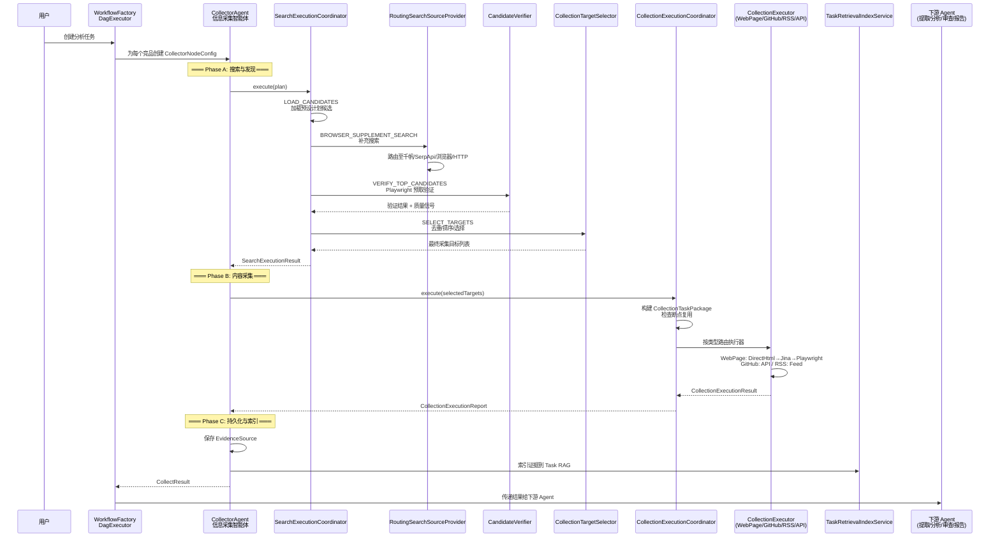
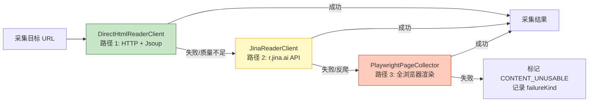

# 搜索与采集架构图

## 1. 五层分层架构总览

```mermaid
graph TB
    subgraph L1["Layer 1: 信源族目录 (Source Family Catalog)"]
        SCP[SearchSourceCatalogProperties<br/>official / news / github]
        SPR[SearchPolicyResolver<br/>族语义解析 / 角色分配]
        SPRole[SearchProviderRole<br/>PRIMARY_VERTICAL / AUXILIARY_PUBLIC]
    end

    subgraph L2["Layer 2: 发现路由 (Discovery Router)"]
        RSSP[RoutingSearchSourceProvider<br/>聚合路由]
        QF[QianfanSearchSourceProvider]
        SERP[SerpApiSearchSourceProvider]
        BRW[BrowserPreviewSearchSourceProvider]
        HTTP[HttpSearchSourceProvider]
        SFDDP[SourceFamilyDirectDiscoveryPlanner<br/>直接路径模板展开]
        SMS[SitemapDiscoveryService<br/>sitemap.xml 发现]
        CDDS[CompetitorDomainDiscoveryService<br/>竞品域名发现]
        HSD[HeuristicSourceDiscoveryService<br/>启发式发现]
    end

    subgraph L3["Layer 3: 候选验证与目标选择 (Candidate Verification & Target Selection)"]
        SEC[SearchExecutionCoordinator<br/>搜索编排核心]
        CV[CandidateVerifier<br/>Playwright 预取验证]
        COP[CandidateOwnershipPolicy<br/>归属判定]
        CTS[CollectionTargetSelector<br/>去重 / 排序 / 选择]
        CUR[CanonicalUrlResolver<br/>规范化 URL]
    end

    subgraph L4["Layer 4: 采集执行器 (Collection Executors)"]
        CEC[CollectionExecutionCoordinator<br/>采集编排]
        CTPB[CollectionTaskPackageBuilder<br/>任务包构建]
        CEReg[CollectionExecutorRegistry<br/>执行器路由]
        WPCE[WebPageCollectionExecutor<br/>DirectHtml → Jina → Playwright]
        GACE[GithubApiCollectionExecutor]
        RFCE[RssFeedCollectionExecutor]
        ADCE[ApiDataCollectionExecutor]
    end

    subgraph L5["Layer 5: 审计 / 回放 / 恢复 (Audit / Replay / Recovery)"]
        SAS[SearchAuditSnapshot]
        SET[SearchExecutionTrace]
        CAS[CollectionAuditSnapshot]
        CRT[CollectionReplayTimelineItem]
        CFK[CollectionFailureKind]
        RCP[RecoveryCheckpointService]
    end

    L1 --> L2 --> L3 --> L4 --> L5

    style L1 fill:#e1f5fe,stroke:#0288d1
    style L2 fill:#fff3e0,stroke:#f57c00
    style L3 fill:#e8f5e9,stroke:#388e3c
    style L4 fill:#fce4ec,stroke:#c62828
    style L5 fill:#f3e5f5,stroke:#7b1fa2
```



## 2. 核心数据流 (端到端)



## 3. WebPageCollectionExecutor 三路径降级策略



## 4. 搜索源提供者路由拓扑

```mermaid
graph TB
    RSSP[RoutingSearchSourceProvider<br/>按权重顺序路由]

    RSSP --> QF[QianfanSearchSourceProvider<br/>千帆搜索]
    RSSP --> SERP[SerpApiSearchSourceProvider<br/>SerpApi]
    RSSP --> BRW[BrowserPreviewSearchSourceProvider<br/>浏览器预览搜索]
    RSSP --> HTTP[HttpSearchSourceProvider<br/>HTTP 搜索]

    RSSP -.->|直接路径补充| SFDDP[SourceFamilyDirectDiscoveryPlanner<br/>docs.{domain}<br/>/pricing /docs /help]
    RSSP -.->|站点发现补充| SMS[SitemapDiscoveryService<br/>sitemap.xml / robots.txt]

    style RSSP fill:#e3f2fd,stroke:#1565c0
```

## 5. 组件关系全景图

```mermaid
graph TB
    subgraph Agent["Agent 层"]
        CA2[CollectorAgent]
    end

    subgraph Search["Search 搜索域"]
        SEC2[SearchExecutionCoordinator]
        SPR2[SearchPolicyResolver]
        SCP2[SearchSourceCatalogProperties]
        CV2[CandidateVerifier]
        CTS2[CollectionTargetSelector]
        CUR2[CanonicalUrlResolver]
        COP2[CandidateOwnershipPolicy]
        SAS2[SearchAuditSnapshot]
        SET2[SearchExecutionTrace]
    end

    subgraph Source["Source 信源域"]
        RSSP2[RoutingSearchSourceProvider]
        QF2[Qianfan]
        SERP2[SerpApi]
        BRW2[BrowserPreview]
        HTTP2[HttpSearch]
        SD2[SourceDiscoveryService]
        HSD2[HeuristicSourceDiscoveryService]
        CDDS2[CompetitorDomainDiscoveryService]
        SFDDP2[SourceFamilyDirectDiscoveryPlanner]
        SMS2[SitemapDiscoveryService]
    end

    subgraph Collection["Collection 采集域"]
        CEC2[CollectionExecutionCoordinator]
        CTPB2[CollectionTaskPackageBuilder]
        CER2[CollectionExecutorRegistry]
        WPCE2[WebPageCollectionExecutor]
        GACE2[GithubApiCollectionExecutor]
        RFCE2[RssFeedCollectionExecutor]
        ADCE2[ApiDataCollectionExecutor]
        CAS2[CollectionAuditSnapshot]
    end

    subgraph Tools["Tools 工具层"]
        JRC[JinaReaderClient]
        DHRC[DirectHtmlReaderClient]
        PPC[PlaywrightPageCollector]
        RFC[RssFeedClient]
        GAC[GithubApiClient]
    end

    subgraph Infra["Infra 基础设施"]
        Config[CollectorProperties<br/>SearchProperties<br/>SearchBrowserProperties]
        RAG2[TaskRetrievalIndexService]
        Repo[EvidenceSource Repository]
        Lock[TaskExecutionLockService]
        RCP2[RecoveryCheckpointService]
    end

    CA2 --> SEC2
    CA2 --> CEC2
    SEC2 --> SPR2 --> SCP2
    SEC2 --> CV2 --> CTS2 --> CUR2
    SEC2 --> COP2
    SEC2 --> SAS2 --> SET2
    SEC2 --> RSSP2
    RSSP2 --> QF2 & SERP2 & BRW2 & HTTP2
    SEC2 -.-> SD2 & HSD2 & CDDS2 & SFDDP2 & SMS2
    CEC2 --> CTPB2
    CEC2 --> CER2
    CER2 --> WPCE2 & GACE2 & RFCE2 & ADCE2
    WPCE2 --> DHRC --> JRC --> PPC
    GACE2 --> GAC
    RFCE2 --> RFC
    CEC2 --> CAS2
    CA2 --> RAG2 --> Repo
    CA2 --> Lock
    CA2 --> RCP2
    Config -.-> SEC2
    Config -.-> CEC2

    style Agent fill:#e8eaf6,stroke:#3949ab
    style Search fill:#e3f2fd,stroke:#1565c0
    style Source fill:#fff3e0,stroke:#ef6c00
    style Collection fill:#fce4ec,stroke:#c62828
    style Tools fill:#e8f5e9,stroke:#2e7d32
    style Infra fill:#f3e5f5,stroke:#6a1b9a
```



## 6. 关键设计原则

| 原则 | 说明 |
|------|------|
| **信源族驱动** | 以业务语义 (official/news/github) 定义信源，而非工具名称 |
| **搜索与采集分离** | 搜索提供者仅作发现工具，不作为业务信源定义 |
| **三路径降级** | WebPage 采集: DirectHtml → Jina → Playwright，渐进增强 |
| **全链路可审计** | 每个结果保留 sourceUrls / qualitySignals / failureKind / replayTimeline |
| **断点可恢复** | RecoveryCheckpoint 支持任务中断后从断点继续 |
| **归属判定** | CandidateOwnershipPolicy 防止中介站点被误认为官方信源 |
